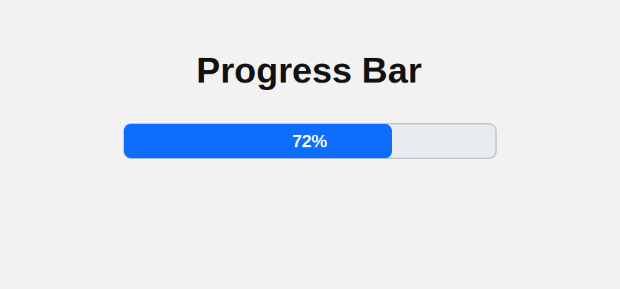

# Bar Chart (React + Vite)

A simple React app that renders a clean two-column vertical bar chart with CSS grid.

## Preview



## What It Shows

- Vertical bar chart UI with a labeled Y-axis (0 to 100)
- Horizontal guide lines for easier value comparison
- Bar heights clamped between `0` and `100`
- Reusable `BarChar` React component with dedicated stylesheet

## Tech Stack

- React
- Vite
- CSS

## Project Structure

```text
src/
  App.jsx
  BarChar.jsx
  BarChar.css
  index.css
```

## Run Locally

```bash
npm install
npm run dev
```

## Build For Production

```bash
npm run build
```

## Preview Production Build

```bash
npm run preview
```
